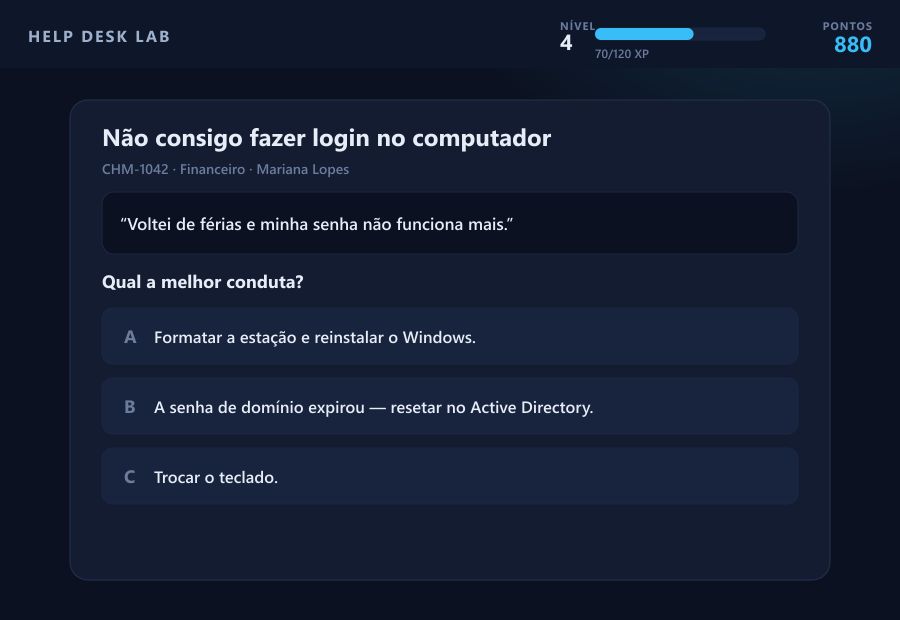

<p align="right"><a href="README.md">🇧🇷 Português</a> · <b>🇺🇸 English</b></p>

<div align="center">


# Help Desk Lab

### Train IT Support by solving real-world problems.

A **hands-on simulation and training platform** for professionals and students of
Help Desk, Technical Support, Infrastructure and Troubleshooting.

[](https://theocomparetti.github.io/helpdesk-lab/)

[](https://github.com/theocomparetti/helpdesk-lab/actions/workflows/ci.yml)
[](LICENSE)
[](#-tech-stack)
[](#-responsiveness)
[](#-running-locally)
[](#)

<br />



</div>

---

## 📋 About the project

**Help Desk Lab** is a web platform that drops the user inside a simulated IT support center. Instead of theory and multiple‑choice quizzes, the person **investigates real problems**: reads user tickets, uses a functional command-line terminal, watches a monitoring board (NOC), fixes network configurations and manages critical incidents — earning experience, levels and achievements along the way.

It runs **100% in the browser**, with no backend, no build and **no external dependencies**. Progress is saved locally, and the interface was designed to feel like a modern SaaS product on both desktop and mobile.

> Built as an in-depth study of **UX/UI, front-end architecture and product design**.

---

## 🎯 The problem it solves

Learning IT Support is hard because theory doesn't prepare you for practice — and nobody wants to **learn by breaking a company's real environment**.

Help Desk Lab creates a **safe, realistic environment** to train the exact day-to-day skills:

- Understanding what the user actually needs (often poorly described);
- Investigating the root cause with real tools (CMD, logs, configurations);
- Prioritizing by impact × urgency (SLA);
- Documenting the solution professionally;
- Making decisions under pressure during critical incidents.

---

## ⚙️ How it works

The loop is simple and engaging: you **pick a challenge** → **investigate** with real tools → **decide** the best course of action → get **technical feedback** with the skills you trained → earn **XP**, level up and unlock **achievements**. The more you solve, the more advanced scenarios unlock.

The platform opens on a **guided hub**: from the first screen the user understands what to do, sees the **Mission of the Day**, their **streak** and quick shortcuts — without getting lost among so many options.

---

## ✨ Features

**28 modules** organized into four pillars. Below, the overview and the highlights.

| Pillar | Modules |
|------|----------|
| **Operations & support** | Ticket Center · Email Center · Monitoring (NOC) · Pressure Mode · Critical Incident |
| **Technical practice** | CMD Terminal · Windows Machine · Network Lab · Remote Access · Log Analysis · Diagnosis · Surprise Challenges |
| **Career & management** | Career Tracks · Interviews · SLA Simulator · Stakeholder Meeting · Executive Panel · Performance · Certifications |
| **Learning & engagement** | Knowledge Base · AI Analyst · Case History · Flash Training · Daily Challenge · Missions |

### 🎫 Realistic support
- **Ticket Center** — real tickets with user name, department, priority and time. You read the report (often vague or badly written), investigate and choose the right action, getting the technical explanation and the trained skills.
- **Email Center** — an inbox where each user writes in their own way (clueless, rushed director, impatient, collaborative). The challenge is to **interpret and classify** the real request.
- **Monitoring (NOC)** — an operations board with real-time status of servers, VPN, DNS, DHCP and printers. Each critical alert becomes a **root-cause** case.

### 💻 Real investigation
- **Interactive CMD terminal** — a functional prompt with `ipconfig`, `ping`, `tracert`, `nslookup`, `netstat`, `route print`, `gpupdate` and more. The output **changes with the scenario** — you discover the cause, you don't guess.
- **Simulated Windows machine** — solve by navigating the system (Services, Network Connections, Task Manager), like on a real corporate workstation.
- **Network Lab** — fix broken configurations (IP, mask, gateway, DNS) with an interactive diagram.
- **Remote Access · Log Analysis · Diagnosis** — connect to the user's machine and collect evidence, read logs with **progressive hints**, or find the root cause from the symptoms.

### 🚨 Pressure and decision-making
- **Critical Incident** — P1 events (VPN down, DNS out, sales system unavailable) with a **running clock** and sequential decisions.
- **Pressure Mode** — several tickets at once: prioritize and resolve against the clock.
- **Surprise Challenges** — **multi-cause** scenarios where one symptom hides two distinct problems.

### 🧭 Career and management
- **Career Tracks** (Intern → Specialist), **Interview Simulator** (real recruiter questions with self-assessment), **SLA Simulator** (prioritizing by impact × urgency) and **Stakeholder Meeting** (justifying your decisions).
- **Executive Panel** — manager-level indicators: SLA met, user satisfaction, efficiency and average handling time. **Performance Analysis** shows your X-ray (accuracy, strengths and weak spots).

### 🏆 "A Day in the Life of an Analyst" — the flagship
A simulation that **ties everything together**: a full shift from **08:00 to 18:00**, with a **corporate clock** that advances as you act, a **dynamic queue** of tickets arriving throughout the day, per-ticket **SLA**, **consequences** (satisfaction goes up or down), mandatory documentation and a **performance report** at the end of the day.

### 🎮 Gamification and engagement
XP and **8 job levels**, achievements (including **hidden badges**), **certifications**, ranking, **daily streak**, **daily goal**, **Mission of the Day** and **Flash Training** (5 challenges in 5 minutes).

> 🔒 **Privacy first:** storage consent (GDPR/LGPD), 100% local data, no servers and no tracking. Your name is only used to display on the ranking.

---

## 🖼️ Screenshots

<div align="center">

<b>Monitoring Center (NOC)</b><br/>


<b>Interactive terminal</b><br/>


<b>Executive Panel</b><br/>


<b>Mobile experience</b><br/>


</div>

---

## 🛠️ Tech stack

- **HTML5** semantic markup
- **CSS3** — custom design system (CSS variables, Grid, Flexbox, consistent dark theme, monochrome SVG icon system)
- **JavaScript (Vanilla)** — modular architecture in a global namespace, **no framework and no build**
- **localStorage** — progress persistence
- **Web Audio API** — sound feedback (no audio files)
- **Google Fonts** — Inter and JetBrains Mono
- **Zero runtime dependencies** · **Zero build step**

> 📐 **Curious about the technical decisions?** See the **[Architecture & Technical Decisions](docs/ARCHITECTURE.md)** document — it covers the reactive rendering model, the module pattern, state management and the trade-offs made. *(Written in Portuguese.)*

---

## 📱 Responsiveness

The experience was designed **mobile-first**, with quality on par with a native app:

- **Desktop:** full sidebar menu + discovery hub.
- **Mobile:** app-style bottom navigation bar, comfortable touch targets, tap feedback, single-column layout and **zero horizontal scrolling**.

---

## 📂 Project structure

```
helpdesk-lab/
├── index.html              # App shell (sidebar, topbar, containers)
├── css/
│   ├── styles.css          # Design system (theme, layout, base components)
│   └── advanced.css        # Advanced module styles + SVG icons
├── js/
│   ├── ui.js               # UI helpers (DOM, SVG icons, modal, toasts, sounds)
│   ├── data.js             # Base content (tickets, diagnoses, KB, achievements)
│   ├── data-phase3.js      # Advanced content (emails, logs, incidents, tracks)
│   ├── data-daylife.js     # "A Day in the Life" mode content
│   ├── state.js            # State, XP/levels, achievements and persistence
│   ├── router.js           # Hash routing (#dashboard, #tickets…)
│   ├── app.js              # Bootstrap, HUD, navigation and consent (GDPR/LGPD)
│   └── modules/            # 28 modules (Dashboard, NOC, Terminal, Day in the Life…)
├── assets/                 # Banner and README images
└── README.md
```

---

## 🚀 Running locally

Since it's **100% static**, there's no install and no build:

**Option 1 — open it directly**
> Double-click `index.html`. It works over `file://`.

**Option 2 — local server (recommended)**
```bash
# with Node
npx serve .

# or with Python
python -m http.server 8000
```
Then open `http://localhost:8000`.

---

## 👤 Author

**Théo Comparetti**

Built with a focus on **user experience, organization and product quality**.

- 💼 LinkedIn: [Théo Comparetti](https://www.linkedin.com/in/th%C3%A9o-comparetti-62b20018a)
- 🐙 GitHub: [@theocomparetti](https://github.com/theocomparetti)
- ✉️ Email: theocomparetti@gmail.com

---

## 📄 License

Released under the **MIT** license. See the [LICENSE](LICENSE) file for details.

<div align="center">

⭐ If this project helped or inspired you, consider leaving a star.

</div>
