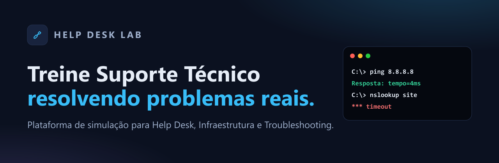
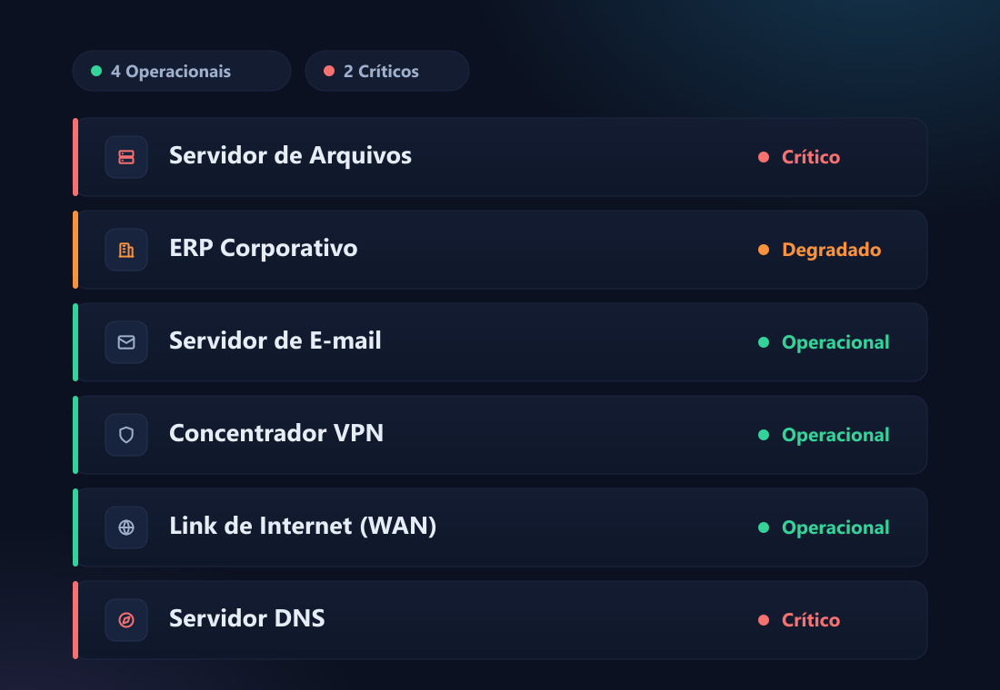
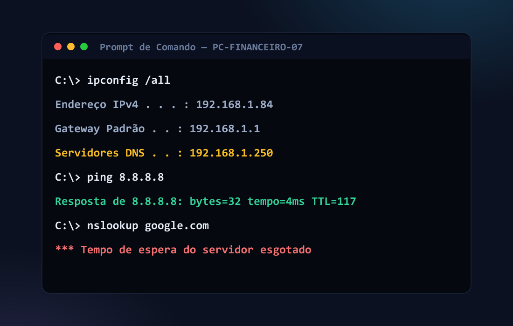
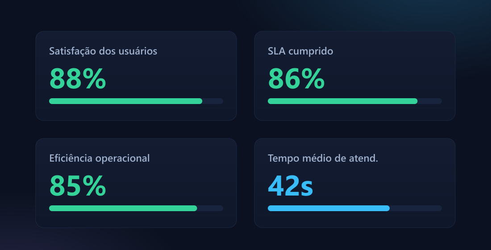
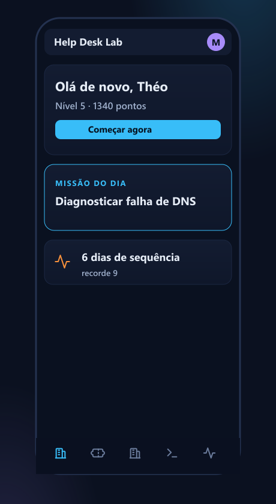

<div align="center">



# Help Desk Lab

### Treine Suporte Técnico resolvendo problemas reais.

Uma plataforma de **simulação e treinamento prático** para profissionais e estudantes de
Help Desk, Suporte Técnico, Infraestrutura e Troubleshooting.

[](LICENSE)
[](#-tecnologias-utilizadas)
[](#-responsividade)
[](#-como-executar-localmente)
[](#)

</div>

---

## 📋 Sobre o projeto

**Help Desk Lab** é uma plataforma web que coloca o usuário dentro de uma central de suporte de TI simulada. Em vez de textos teóricos e quizzes de múltipla escolha, a pessoa **investiga problemas reais**: lê chamados de usuários, usa um terminal de comandos funcional, acompanha um painel de monitoramento (NOC), corrige configurações de rede e gerencia incidentes críticos — ganhando experiência, níveis e conquistas no processo.

Tudo roda **100% no navegador**, sem backend, sem build e **sem nenhuma dependência externa**. O progresso é salvo localmente e a interface foi pensada para parecer um produto SaaS moderno, tanto no desktop quanto no celular.

> Projeto desenvolvido como estudo aprofundado de **UX/UI, arquitetura front-end e design de produto**.

---

## 🎯 Problema que resolve

Aprender Suporte Técnico é difícil porque a teoria não prepara para a prática — e ninguém quer **aprender errando no ambiente real de uma empresa**.

O Help Desk Lab cria um **ambiente seguro e realista** para treinar exatamente as competências do dia a dia:

- Interpretar o que o usuário realmente precisa (muitas vezes mal descrito);
- Investigar a causa raiz com ferramentas reais (CMD, logs, configurações);
- Priorizar por impacto × urgência (SLA);
- Documentar a solução de forma profissional;
- Tomar decisões sob pressão em incidentes críticos.

---

## ⚙️ Como funciona

O ciclo é simples e envolvente: você **escolhe um desafio** → **investiga** com ferramentas reais → **decide** a melhor conduta → recebe um **feedback técnico** com as competências treinadas → ganha **XP**, sobe de **nível** e desbloqueia **conquistas**. Quanto mais você resolve, mais cenários avançados são liberados.

A plataforma abre num **hub guiado**: logo na primeira tela o usuário entende o que fazer, vê a **Missão do Dia**, sua **sequência (streak)** e atalhos para começar — sem se perder no meio de tantas opções.

---

## ✨ Funcionalidades

São **28 módulos** organizados em quatro pilares. Abaixo, a visão geral e o detalhe dos principais.

| Pilar | Módulos |
|------|----------|
| **Operação & atendimento** | Central de Chamados · Central de E-mails · Monitoramento (NOC) · Modo Pressão · Incidente Crítico |
| **Prática técnica** | Terminal CMD · Máquina Windows · Laboratório de Redes · Acesso Remoto · Análise de Logs · Diagnóstico · Desafios Surpresa |
| **Carreira & gestão** | Trilhas de Carreira · Entrevistas · Simulador de SLA · Reunião com Gestores · Painel Executivo · Desempenho · Certificações |
| **Aprendizado & engajamento** | Base de Conhecimento · IA Analista · Histórico de casos · Treino Relâmpago · Desafio Diário · Missões |

### 🎫 Atendimento realista
- **Central de Chamados** — tickets reais com nome do usuário, setor, prioridade e horário. Você lê o relato (muitas vezes vago ou mal escrito), investiga e escolhe a conduta certa, recebendo a explicação técnica e as competências treinadas.
- **Central de E-mails** — uma caixa de entrada onde cada usuário escreve do seu jeito (leigo, diretor apressado, impaciente, colaborativo). O desafio é **interpretar e classificar** a real demanda.
- **Monitoramento (NOC)** — painel de operações com status em tempo real de servidores, VPN, DNS, DHCP e impressoras. Cada alerta crítico vira um caso de **causa raiz**.

### 💻 Investigação de verdade
- **Terminal CMD interativo** — um prompt funcional com `ipconfig`, `ping`, `tracert`, `nslookup`, `netstat`, `route print`, `gpupdate` e outros. As saídas **mudam conforme o cenário** — você descobre a causa, não chuta a resposta.
- **Máquina Windows simulada** — resolva navegando pelo sistema (Serviços, Conexões de Rede, Gerenciador de Tarefas), como numa estação corporativa real.
- **Laboratório de Redes** — corrija configurações quebradas (IP, máscara, gateway, DNS) com diagrama interativo.
- **Acesso Remoto · Análise de Logs · Diagnóstico** — conecte na máquina do usuário e colete evidências, leia logs com **dicas graduais**, ou encontre a causa raiz a partir dos sintomas.

### 🚨 Pressão e tomada de decisão
- **Incidente Crítico** — eventos P1 (VPN caiu, DNS fora, sistema de vendas indisponível) com **relógio correndo** e decisões em sequência.
- **Modo Pressão** — vários chamados ao mesmo tempo: priorize e resolva contra o cronômetro.
- **Desafios Surpresa** — cenários **multi-causa** em que um sintoma esconde dois problemas distintos.

### 🧭 Carreira e gestão
- **Trilhas de Carreira** (Estagiário → Especialista), **Simulador de Entrevistas** (perguntas reais de recrutador com autoavaliação), **Simulador de SLA** (priorização por impacto × urgência) e **Reunião com Gestores** (justificar suas decisões).
- **Painel Executivo** — indicadores de gestor: SLA cumprido, satisfação dos usuários, eficiência e tempo médio de atendimento. A **Análise de Desempenho** mostra seu raio-x (precisão, pontos fortes e a melhorar).

### 🏆 "Dia na Vida de um Analista" — o carro-chefe
Uma simulação que **amarra tudo**: um expediente completo das **08:00 às 18:00**, com **relógio corporativo** que avança conforme suas ações, **fila dinâmica** de chamados que chegam ao longo do dia, **SLA** por chamado, **consequências** (a satisfação sobe ou cai), documentação obrigatória e um **relatório de desempenho** ao fim do expediente.

### 🎮 Gamificação e engajamento
XP e **8 níveis de cargo**, conquistas (incluindo **badges ocultos**), **certificações**, ranking, **streak diário**, **meta diária**, **Missão do Dia** e **Treino Relâmpago** (5 desafios em 5 minutos).

> 🔒 **Privacidade primeiro:** consentimento de armazenamento (LGPD), dados 100% locais, sem servidores nem rastreamento. O nome é usado apenas para exibição no ranking.

---

## 🖼️ Capturas de tela

<div align="center">

| Central de Monitoramento (NOC) | Terminal interativo |
|:--:|:--:|
|  |  |

| Painel Executivo | Experiência mobile |
|:--:|:--:|
|  |  |

</div>

---

## 🛠️ Tecnologias utilizadas

- **HTML5** semântico
- **CSS3** — design system próprio (variáveis CSS, Grid, Flexbox, tema escuro consistente, sistema de ícones SVG monocromáticos)
- **JavaScript (Vanilla)** — arquitetura modular em namespace global, **sem framework e sem build**
- **localStorage** — persistência de progresso
- **Web Audio API** — feedback sonoro (sem arquivos de áudio)
- **Google Fonts** — Inter e JetBrains Mono
- **Zero dependências de runtime** · **Zero etapa de build**

---

## 📱 Responsividade

A experiência foi desenhada **mobile-first**, com qualidade equivalente a um aplicativo nativo:

- **Desktop:** menu lateral completo + hub de descoberta.
- **Mobile:** barra de navegação inferior estilo app, alvos de toque confortáveis, feedback ao toque, layout em coluna única e **zero rolagem horizontal**.

---

## 📂 Estrutura do projeto

```
helpdesk-lab/
├── index.html              # Shell da aplicação (sidebar, topbar, containers)
├── css/
│   ├── styles.css          # Design system (tema, layout, componentes base)
│   └── advanced.css        # Estilos dos módulos avançados + ícones SVG
├── js/
│   ├── ui.js               # Helpers de UI (DOM, ícones SVG, modal, toasts, sons)
│   ├── data.js             # Conteúdo base (chamados, diagnósticos, KB, conquistas)
│   ├── data-phase3.js      # Conteúdo avançado (e-mails, logs, incidentes, trilhas)
│   ├── data-daylife.js     # Conteúdo do modo "Dia na Vida"
│   ├── state.js            # Estado, XP/níveis, conquistas e persistência
│   ├── router.js           # Roteamento por hash (#dashboard, #tickets…)
│   ├── app.js              # Bootstrap, HUD, navegação e consentimento (LGPD)
│   └── modules/            # 28 módulos (Dashboard, NOC, Terminal, Dia na Vida…)
├── assets/                 # Banner e imagens do README
└── README.md
```

---

## 🚀 Como executar localmente

Por ser **100% estático**, não há instalação nem build:

**Opção 1 — abrir direto**
> Dê um duplo clique em `index.html`. Funciona via `file://`.

**Opção 2 — servidor local (recomendado)**
```bash
# com Node
npx serve .

# ou com Python
python -m http.server 8000
```
Depois acesse `http://localhost:8000`.

### Publicar no GitHub Pages
O projeto já é compatível com GitHub Pages (caminhos relativos + roteamento por hash). Basta ativar **Settings → Pages → Deploy from branch → `main` / root**. Inclui um arquivo `.nojekyll` para evitar processamento do Jekyll.

---

## 👤 Autor

**Théo Comparetti**

Desenvolvido com foco em **experiência do usuário, organização e qualidade de produto**.

- 💼 LinkedIn: [Théo Comparetti](https://www.linkedin.com/in/th%C3%A9o-comparetti-62b20018a)
- 🐙 GitHub: [@theocomparetti](https://github.com/theocomparetti)
- ✉️ E-mail: theocomparetti@gmail.com

---

## 📄 Licença

Distribuído sob a licença **MIT**. Veja o arquivo [LICENSE](LICENSE) para mais detalhes.

<div align="center">

⭐ Se este projeto te ajudou ou te inspirou, considere deixar uma estrela.

</div>
